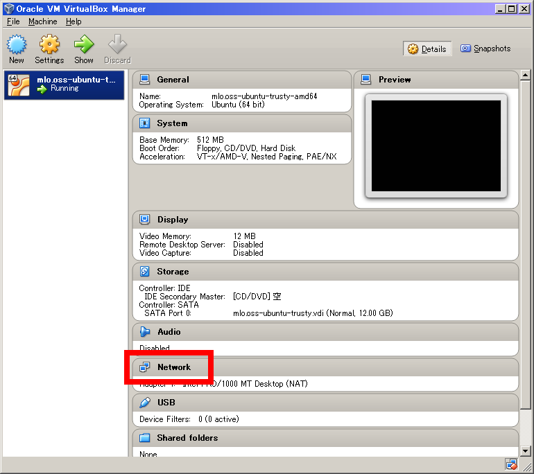
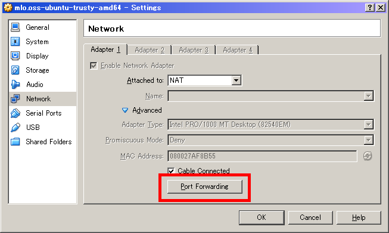
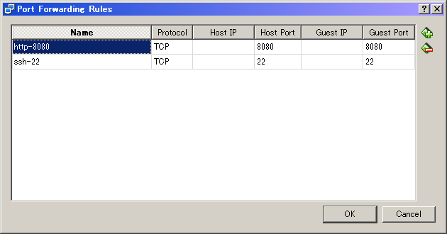

Port forwarding settings on Oracle VM VirtualBox
================
The easiest way to connect mlo-gui to mlo-net is to use port forwarding 
feature of Oracle VM VirtualBox.
In this document, procedure to set port forwarding rules is explained.

mlo-net provides web API on port 8080. On the other hand, mlo-net 
environment as guest VM behinds NAT by default. So mlo-gui on host VM 
cannot access to port 8080 on mlo-net without port forwarding.

To set port forwarding rules on Oracle VM VirtualBox, select your 
virtual machine on Oracle VM VirtualBox Manager, and then click
"Network" link to open "Settings" dialog box.

And then, click "Port Forwarding" button on "Adapter 1" tab to open
"Port Forwarding Rules" dialog box.

Click "Add" icon to add a line, and then set as follows:

<table>
    <tr><th>Item</th><th>Value</th></tr>
    <tr><td>Name</td><td>http-8080</td></tr>
    <tr><td>Protocol</td><td>TCP</td></tr>
    <tr><td>Host IP</td><td>&lt;&lt;BLANK&gt;&gt;</td></tr>
    <tr><td>Host Port</td><td>8080</td></tr>
    <tr><td>Guest IP</td><td>&lt;&lt;BLANK&gt;&gt;</td></tr>
    <tr><td>Guest Port</td><td>8080</td></tr>
</table>

This setting means that access to port 8080 of any address on host VM 
is forwarded to port 8080 of any address on guest VM.

Similarly, port 22 forwarding rule would be useful to ssh to guest 
VM using terminal software like putty.

At the end, click "OK" button to save those settings.

